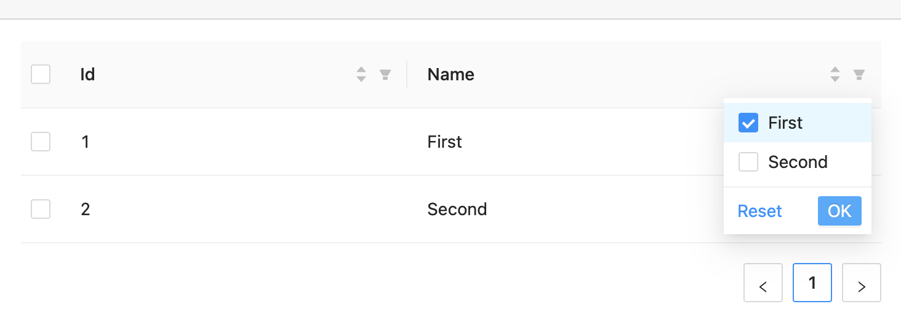

# Bug reproducible demo for ant-design-blazor

## How to see the bug in v `0.9.2`
* build and run solution
* navigate to `localhost:5001`
* try to filter by name and click OK:
  
* nothing happens until you click on the select checkbox

## Rollback to v `0.9.1.1` to check the working filtering
* build and run solution
* navigate to `localhost:5001`
* try to filter by name and click OK
* table is filtered without any additional interaction

## Bug is fixed in v `0.9.3`
by [issue 1874](https://github.com/ant-design-blazor/ant-design-blazor/issues/1874) and [PR 1875](https://github.com/ant-design-blazor/ant-design-blazor/pull/1875)